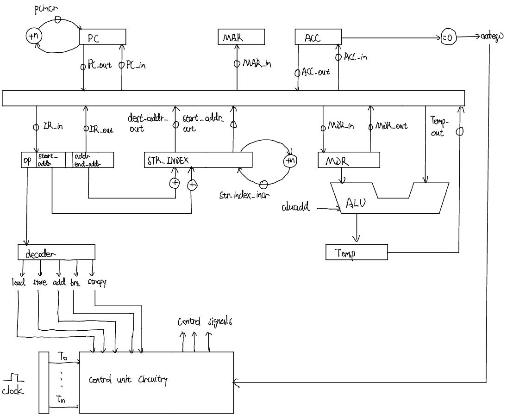

# microcode_beginner_project

This is an implementation of the simple multi-cycle processor in https://people.computing.clemson.edu/~mark/uprog.html using microcode. We also implement a string copy operation besides the load, add, store, and brz operations.

## Instructions:

```
(opcode 000)  load  address      :  ACC <- memory[ address ]

(opcode 001)  add   address      :  ACC <- ACC + memory[ address ]

(opcode 010)  store address      :  memory[ address ] <- ACC

(opcode 011)  brz   address      :  if( ACC == 0 ) PC <- address

(opcode 100)  strcpy source dest :  memory[ dest ] <- memory[ source .. \0 ] 
100. xxxxxx yyyyyyy
```

## Control Signals Definition:

```ACC_in   : ACC <- CPU internal bus
ACC_out  : CPU internal bus <- ACC
aluadd   : addition is selected as the ALU operation
IR_in    : IR <- CPU internal bus
IR_out   : CPU internal bus <- address portion of IR
MAR_in   : MAR <- CPU internal bus
MDR_in   : MDR <- CPU internal bus
MDR_out  : CPU internal bus <- MDR
PC_in    : PC <- CPU internal bus
PC_out   : CPU internal bus <- PC
pcincr   : PC <- PC + 1
read     : MDR <- memory[ MAR ]
TEMP_out : CPU internal bus <- TEMP
write    : memory[ MAR ] <- MDR

NEW:
start_addr_out       : CPU internal bus <- start_address + str_index
dest_addr_out        : CPU internal bus <- destination_address + str_index
str_index_incr       : str_index <- str_index + 1
check_end_str        : control the loop of strcpy


```

## Control Sequences:

```
clock cycle   CSAR    control signals                             next addr
	

	  0     00000    PC_out, MAR_in                                00010
	  1     00010 	 read, pcincr                                  00011
	  2     00011    MDR_out, IR_in                                00100
	  3     00100    branch-via-table (to one of the cases below)  
	  
	a strcpy instruction causes a branch to 10000 for cycle 4: (NEW)
	  4     10000    start_addr_out, MAR_in                        10001
	  5     10001    read                                          10010
	  6     10010    MDR_out, ACC_in                               10011   
      7     10011    dest_addr_out, MAR_in                         10100
      8     10100    ACC_out, MDR_in                               10101
      9     10101    write, str_index_incr                         10110
      10    10110    check_end_str           if (acc==0):          00000
      ...                                    else: loop back to    10000  
	
	(The following is the same as before)
	a load instruction causes a branch to 00101 for cycle 4:

	  4     00101    IR_out(addr part), MAR_in                     00110
	  5     00110    read                                          00111
	  6     00111    MDR_out, ACC_in (and jump to 00000)           00000


	or an add instruction causes a branch to 01000 for cycle 4:

	  4     01000    IR_out(addr part), MAR_in                     01001
	  5     01001    read                                          01010
	  6     01010    ACC_out, aluadd                               01011
	  7     01011    TEMP_out, ACC_in (and jump to 00000)          00000


	or a store instruction causes a branch to 01100 for cycle 4:

	  4     01100    IR_out(addr part), MAR_in                     01101
	  5     01101    ACC_out, MDR_in                               01110
	  6     01110    write (and jump to 00000)                     00000


	or a brz instruction causes a branch to 1111 for cycle 4; the branch
	  may either be untaken, in which case control returns to the start
	  of the next macroinstruction fetch at address 0000:

	  4     01111    or_address_with_acceq0  if (acc==0):          00001
	                                         else:                 00000
```

## Datapath



