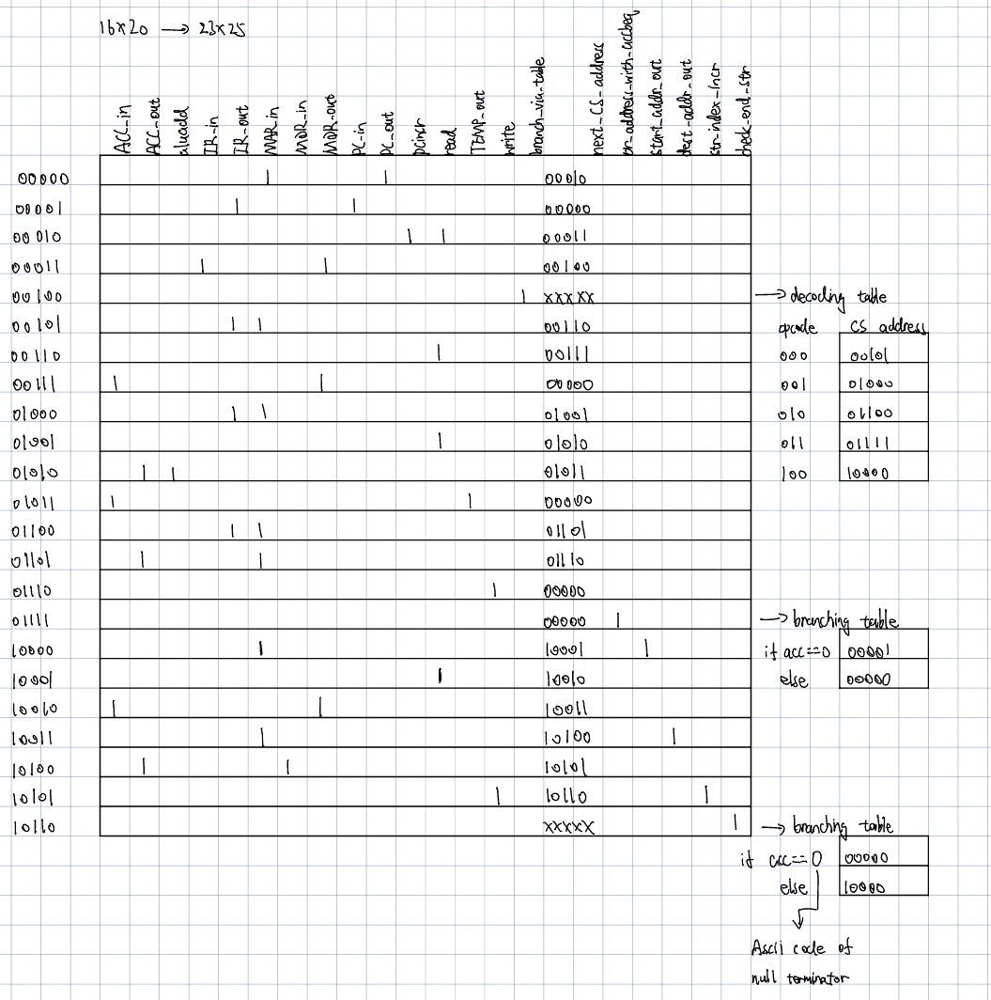

## Details about Strcpy:

#### Instruction:

```
(opcode 100)  strcpy source dest :  memory[ dest ] <- memory[ source .. \0 ] 
100. xxxxxx yyyyyyy
```

#### Example:

```
before memory:
00: ----


f0: ffff
  : ffff
  : 0000

after memory:
00: ffff
  : ffff
  : 0000

f0: ffff
  : ffff
  : 0000

strcpy f0 00
==> ACC <- mem[f0]
==> mem[00] <- ACC
==> ACC <- mem[fX]
==> mem[0X] <-- ACC
==> ...
```

#### Implementation Plan


Instruction decode:

1. change the opcode to 3 bits wide
2. In addition to the addr, we create two more Wirevectors for the start address(6 bits) and the destination address(7 bits). We get the values of start address and the destination address for every instruction, but we only use them in strcpy.

Implementation of string copy:

1. We create a new register str_index to keep track to the current index of the string

1. We have four more control units: 

   start_addr_out: Similar to IR_out, we put the value of start_address+ str_index to the bus, which is the current address of the char in the string we are copying

   dest_addr_out:  Similar to IR_out, we put the value of dest_address+ str_index to the bus, which is the the destination address of this copied char

   str_index_incr: After copying one char, we increment the str_index register by one, so we will look at the next char in the next loop

   check_str_end: the control unit for branching. It is used to check if the current element is the null terminator.

2. We use load + store for each char in the string
3. After copying each char, we need to check if the value in acc is the end string char. If it is true we go to the next instr. Otherwise we copy the char in the next address.


##### Control Signals Definitions:

```
ACC_in   : ACC <- CPU internal bus
ACC_out  : CPU internal bus <- ACC
aluadd   : addition is selected as the ALU operation
IR_in    : IR <- CPU internal bus
IR_out   : CPU internal bus <- address portion of IR
MAR_in   : MAR <- CPU internal bus
MDR_in   : MDR <- CPU internal bus
MDR_out  : CPU internal bus <- MDR
PC_in    : PC <- CPU internal bus
PC_out   : CPU internal bus <- PC
pcincr   : PC <- PC + 1
read     : MDR <- memory[ MAR ]
TEMP_out : CPU internal bus <- TEMP
write    : memory[ MAR ] <- MDR

NEW:
start_addr_out       : CPU internal bus <- start_address + str_index
dest_addr_out        : CPU internal bus <- destination_address + str_index
str_index_incr       : str_index <- str_index + 1
check_end_str        : control the loop of strcpy
```

##### Control Sequence of Five Instructions:


```
clock cycle   CSAR    control signals                             next addr
	

	  0     00000    PC_out, MAR_in                                00010
	  1     00010 	 read, pcincr                                  00011
	  2     00011    MDR_out, IR_in                                00100
	  3     00100    branch-via-table (to one of the cases below)  
	  
	a strcpy instruction causes a branch to 10000 for cycle 4: (NEW)
	  4     10000    start_addr_out, MAR_in                        10001
	  5     10001    read                                          10010
	  6     10010    MDR_out, ACC_in                               10011 
      
      7     10011    dest_addr_out, MAR_in                         10100
      8     10100    ACC_out, MDR_in                               10101
      9     10101    write, str_index_incr                         10110
      10    10110    check_end_str           if (acc==0):          00000
      ...                                    else: loop back to    10000  
	
	(The following is the same as before)
	a load instruction causes a branch to 00101 for cycle 4:

	  4     00101    IR_out(addr part), MAR_in                     00110
	  5     00110    read                                          00111
	  6     00111    MDR_out, ACC_in (and jump to 00000)           00000


	or an add instruction causes a branch to 01000 for cycle 4:

	  4     01000    IR_out(addr part), MAR_in                     01001
	  5     01001    read                                          01010
	  6     01010    ACC_out, aluadd                               01011
	  7     01011    TEMP_out, ACC_in (and jump to 00000)          00000


	or a store instruction causes a branch to 01100 for cycle 4:

	  4     01100    IR_out(addr part), MAR_in                     01101
	  5     01101    ACC_out, MDR_in                               01110
	  6     01110    write (and jump to 00000)                     00000


	or a brz instruction causes a branch to 1111 for cycle 4; the branch
	  may either be untaken, in which case control returns to the start
	  of the next macroinstruction fetch at address 0000:

	  4     01111    or_address_with_acceq0 (yields jump to 0000)  00000
```


### Control Table of Five Instructions:




